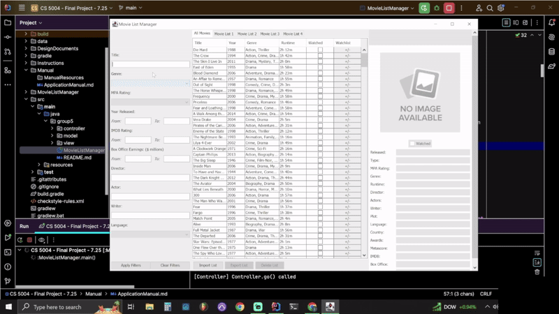
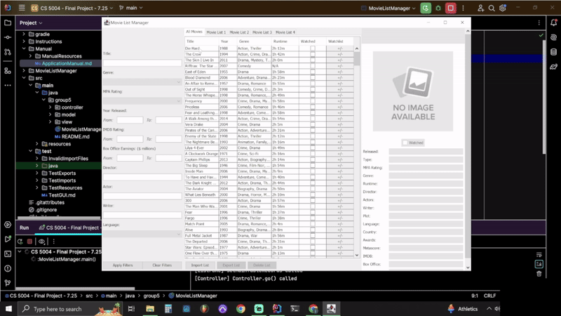
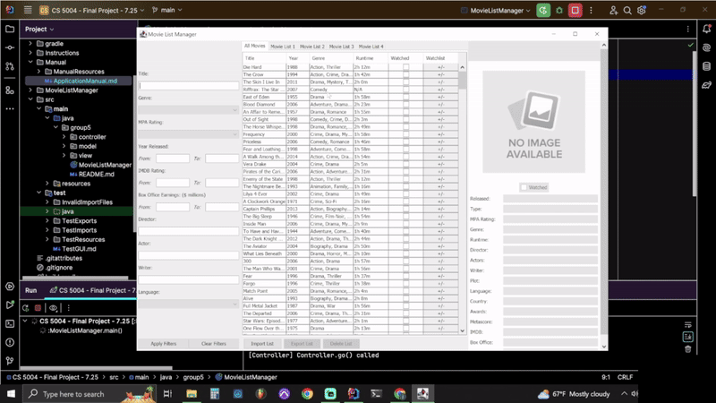
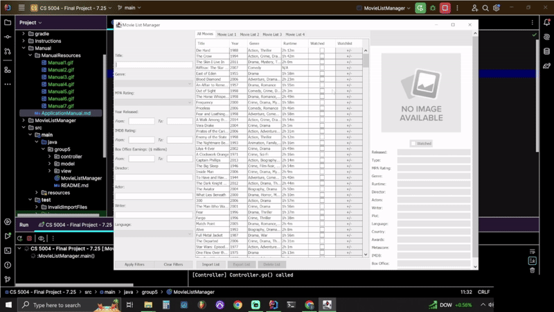
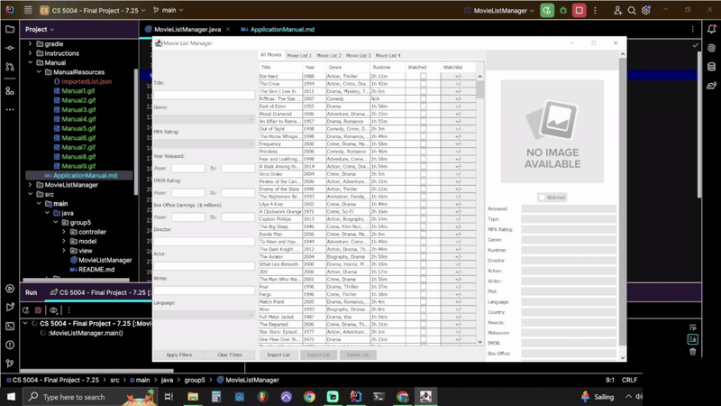
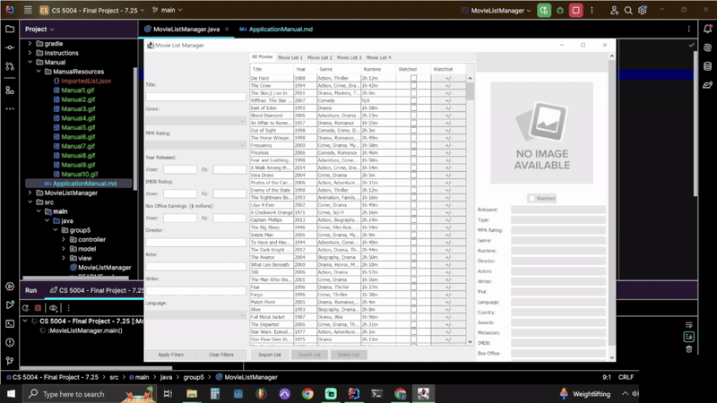
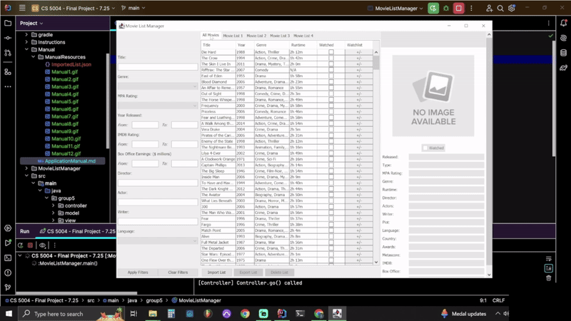
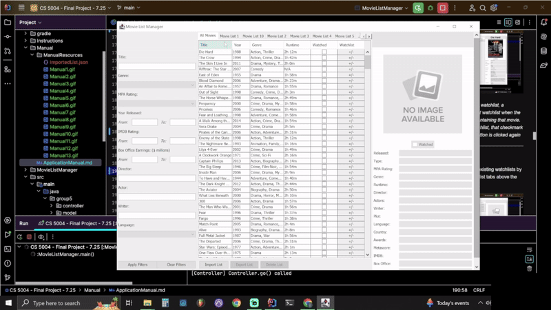
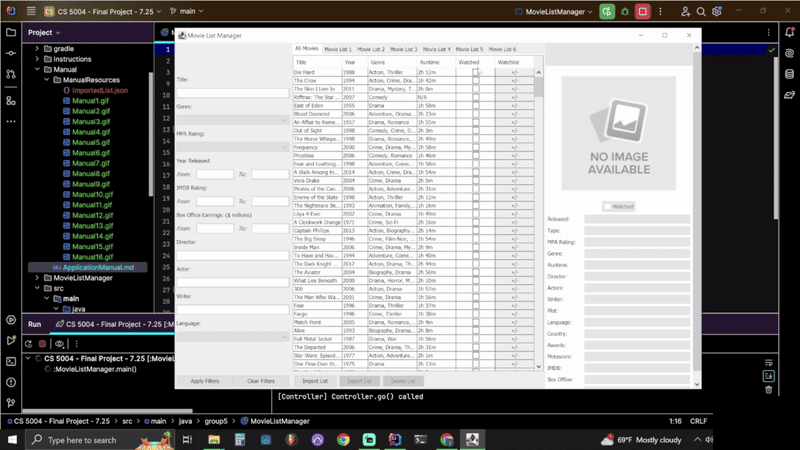
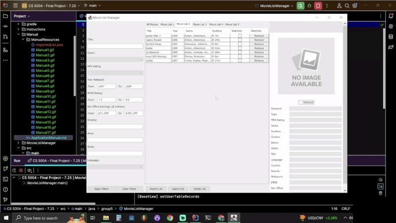

# Movie List Manager Manual 

---

### App Description:

The Movie List Manager is a Java Swing app, powered by the [OMDb movies API](https://www.omdbapi.com/), intended to 
enable users to create and manage movie watchlists

With the Movie List Manager, users can:

- View, filter, sort and select movies from a source list
- Add or remove movies to/from any number of user created watchlists
- View movie details for any selected movie in any watchlist including the source list
- Record specific movies as 'Watched'
- Record personal movie ratings (from 1.0 - 10.0)
- Delete watchlists
- Import watchlists from a file (JSON or CSV)
- Export watchlists to a file (XML, JSON, CSV or TXT)

All changes made to watchlists, including the 'All Movies' source list, are automatically saved, and persist from 
session to session

#### *For definitions pertaining to the components of this application, please refer to the Glossary at the bottom of this manual*

---

### How to Run This Application:

#### To run this application from within an IDE

- Clone this repo and run the driver class: [*MovieListManager.java*](https://github.com/Su24-CS5004-Online-Lionelle/final-project-group-5/blob/main/src/main/java/group5/MovieListManager.java)
  located in the src folder

#### To run this application from a terminal

- Download the [*MovieListManager* folder](https://github.com/Su24-CS5004-Online-Lionelle/final-project-group-5/tree/main/MovieListManager),
  navigate to this folder in your terminal and enter the command in the block below into the terminal

```
java -jar MovieListManager.jar
```

---

### How to Use This Application:

---
#### Searching for movies in the 'All Movies' source list
- Movies can be found in the 'All Movies' source list through applying filters via the Filter Pane, on the left hand
side of the application window. To filter the selected list (in this case the 'All Movies' list), simply populate the 
filters in the Filter Pane and click the 'Apply Filters' button on the bottom left of the Filter Pane



*NOTE: Users can continue to apply filters to the same filtered list after the 'Apply Filters' button has already been
clicked*

- To clear filters from the Filter Pane, and revert the selected list back to its unfiltered state, click the
'Clear Filters' button on the bottom right of the Filter Pane


---

#### Searching for movies not available in the 'All Movies' source list and adding them to the 'All Movies' source list

- If a movie is not currently available in the 'All Movies' source list, users can enter the full movie title in the 
'Title' filter at the top of the Filter Pane to query the [OMDb movies API](https://www.omdbapi.com/) for that movie.
If that movie is available in the [OMDb movies API](https://www.omdbapi.com/), then that movie will be added to the 
'All Movies' source list


*NOTE: Adding movies via the [OMDb movies API](https://www.omdbapi.com/) will add those movies to the source file 
containing the 'All Movies' source list. This change will persist between sessions if the Movie List Manager is closed*

---
#### Viewing movie details from the 'All Movies' tab and watchlist tabs

- To view movie details for a movie in the 'All Movies' source list, or a user created watchlist, simply select a movie
in the table on List Pane, in the middle of the application window. Upon clicking, that movies' details will appear in 
the Details Pane on the right hand side of the application window



*NOTE: This process is the same for movies in the 'All Movies' source list and all other watchlists*

---
#### Recording movies as 'Watched'

- Users can record that they have watched a particular movie by clicking the checkbox in the 'Watched' column of the 
table in the List Pane of the selected tab, in the row containing that particular movie


- Users can also record particular movies as watched via the Details Pane
- First, click on the watched movie in either the 'All Movies' source list or another watchlist
- Next, click on the 'Watched' checkbox underneath the movie poster in the Details Pane



*NOTE: Clicking the 'Watched' checkbox in either the List Pane or the Details Pane will save that 'Watched' data between
sessions if the Movie List Manager is closed*

---

#### Recording user movie ratings

- Users can record personal movie ratings using the 'My Rating' field in the Details Pane
- First, select a movie in the 'All Movies' source list, or in another watchlist
- Next, navigate to the bottom of the Details Pane and click on the 'My Rating' field's placeholder text: 
"Enter your rating here (1 - 10)"
- Lastly, enter your user rating (from 1 - 10) and click out of the 'My Rating' text field


*NOTE: User ratings are recorded in the Details Pane once the user rating is entered, **AND** the 'My Rating' field is 
clicked out of (meaning any other application component is clicked)*

---

#### Creating new watchlists

- Users can create a new watchlist by navigating to a desired movie in the 'All Movies' source list and clicking the
"+/-" button in the 'Watchlist' column within the row containing the desired movie
- Once clicked, a popup menu will appear. Click on the option 'Add To New Watchlist' at the bottom of that popup 
menu
- Another popup will appear prompting the user to enter a name for that new watchlist. Enter a watchlist name and click
'OK' to create a new watchlist containing the selected movie. Click 'Cancel' to close the popup without creating a new 
watchlist



- Users can also create new watchlists by loading watchlists from a file. Simply click the 'Import List' button at the 
bottom left of the List Pane. A file chooser window will appear, where users can navigate to the wacthlist file that
they wish to add
- Upon clicking the 'Open' button, a new watchlist will be created with the same name as the file name selected by the 
user


*NOTE: Watchlist names must be unique. If a user attempts to create a new watchlist with the same name as an existing 
watchlist, the application will trigger an error popup, and the new watchlist will not be created*

*NOTE: Only JSON or CSV files can be used to import new watchlists*

---

#### Adding and removing movies to/from watchlists

- Users can add movies to existing watchlists from the 'All Movies' source list by navigating to a desired movie in the 
'All Movies' source list and clicking the "+/-" button in the 'Watchlist' column within the row containing the desired 
movie
- A popup will appear containing the existing watchlists in the application. Clicking on an existing watchlist will add
that movie to the clicked watchlist



- To remove a movie from an existing watchlist, using the 'All Movies' source list, follow the same process detailed 
above for adding a movie to an existing watchlist
- Once the "+/-" button is clicked, and the corresponding popup menu appears, a checkmark will appear next to the
watchlists containing the selected movie. Clicking on a watchlist with a checkmark will remove the selected movie from
that watchlist



- Users can also remove movies from a watchlist by navigating to that watchlist in the List Pane and clicking the 
'Remove' button in the 'Watchlist' column of the row containing the movie to be removed. Clicking this button will
remove that movie from that watchlist


*NOTE: If a movie is available in a watchlist, a checkmark will appear next to that watchlist when the '+/-' button is
clicked in the row containing that movie. If a movie is removed from a watchlist, that checkmark will not appear if the 
same '+/-' button is clicked again*

---

#### Navigating through watchlists

- Users can navigate through existing watchlists by clicking corresponding watchlist tabs above the table in the List
Pane



- If there are too many watchlist tabs to view each tab inside of the current application window, users can click on the 
arrows at the top right of the List Pane to navigate through existing watchlists



---

#### Sorting movies in watchlists

- To sort movies in a selected tab in the List Pane, users can click on the column header corresponding to the field
that they wish to sort by


*NOTE: clicking on a column header once will sort the movie list by that column ascending. Clicking on that same column
header again will sort the movie list by that same column descending*

---

#### Filtering movies in watchlists

- Users can filter through movies in a selected watchlist using the same process detailed in the 'Searching for 
movies in the 'All Movies' source list' section of this manual


*NOTE: when a watchlist (not the 'All Movies' source list) is selected, the filter ranges (Year Released, IMDB Rating & 
Box Office Earnings) will populate with placeholders detailing the min & max values of each field for all movies in that 
watchlist. Filtering that watchlist will not change these placeholders, as the placeholders are meant to detail the 
ranges in that whole list, and not only the filtered version of that list*

*NOTE: The Box Office Earnings range filters detail box office earnings in millions of dollars. This field is only 
intended to take input in millions of dollars (i.e. enter '1' for '$1,000,000')*

*NOTE: Clicking the 'Apply Filters' button when no information has been entered in the Filter Pane will **NOT** filter
the selected list*

---

#### Deleting watchlists

- Users can delete a watchlist by selecting a watchlist in the List Pane and clicking the 'Delete List' button
on the bottom right of the List Pane
- Upon clicking the 'Delete List' button, a popup window will appear confirming that the user wants to delete the
selected watchlist. Clicking the 'Yes' button in the popup will delete that watchlist. Clicking the 'No' button will
close the popup window without deleting that watchlist




*NOTE: The 'All Movies' source list cannot be deleted*

*NOTE: Watchlist deletions are saved between sessions. Meaning a deleted watchlist will **NOT** reappear if the 
application is closed and relaunched*

*NOTE: Removing all of the movies from an existing watchlist will **NOT** delete that watchlist*

---

#### Exporting watchlists to a file

- Users can export watchlists to a file using the 'Export List' button at the bottom of the List Pane
- Upon clicking the 'Export List' button, a file chooser window will appear allowing users to navigate to the folder 
in which they wish to save the exported watchlist, and to name the exported file
- Clicking the 'Save' button in the file chooser will save that file to the users selected path
- Clicking the 'Cancel' button will close the file chooser without exporting that watchlist



*NOTE: Users can export files in XML, JSON, CSV or TXT file formats*

*NOTE: Only files exported in JSON and CSV formats can be reimported into the Movie List Manager*

---

### Glossary

| **Term**                                      | **Definition**                                                                                                                                                                                                                              |
|-----------------------------------------------|---------------------------------------------------------------------------------------------------------------------------------------------------------------------------------------------------------------------------------------------|
| *Movie List Manager*                          | This application detailed in this manual                                                                                                                                                                                                    |
| [*OMDb movies API*](https://www.omdbapi.com/) | The API from which the data in this application is sourced                                                                                                                                                                                  |
| *Filter Pane*                                 | The panel, on the left hand side of the application window, containing filter fields and filter buttons                                                                                                                                     |
| *List Pane*                                   | The panel, in the center of the application window, containing a source movie list, movie watchlists, a table detailing the movies within each list, and buttons enabling users to import, export and delete watchlists                     |
| *Details Pane*                                | The panel, on the right hand side of the application window, containing details pertaining to the movie selected in the watchlist table in the List Pane, as well as fields where users can enter watched status and personal movie ratings |
| *Title*                                       | The title of a movie                                                                                                                                                                                                                        |
| *Genre*                                       | The genres that apply to a movie. Most movies are associated with more than one genre                                                                                                                                                       |
| *MPA Rating*                                  | The Motion Picture Association rating of a movie (ex: PG, PG-13, R)                                                                                                                                                                         |
| *Year, Year Released*                         | The year that a movie was released                                                                                                                                                                                                          |
| *Released*                                    | The date that on which a movie was released                                                                                                                                                                                                 |
| *IMDB Rating, IMDB*                           | The rating (from 1 - 10) that a movie received on IMDB                                                                                                                                                                                      |
| *Box Office Earnings, Box Office*             | The amount of money a movie earns in ticket sales (i.e. ticket sale revenue)                                                                                                                                                                |
| *Director*                                    | The director(s) of a movie. It is not uncommon for a movie to have more than one director                                                                                                                                                   |
| *Actor*                                       | The actor(s) in a movie. Most movies have many actors                                                                                                                                                                                       |
| *Writer*                                      | The writer(s) of a movie. Most movies have more than one writer                                                                                                                                                                             |
| *Language*                                    | The languages in which a movie is available. Most movies are available in many languages                                                                                                                                                    |
| *Type*                                        | Denotes if a work is a movie, or TV series. This application currently only details movies from the [OMDb movies API](https://www.omdbapi.com/)                                                                                             |
| *Runtime*                                     | The duration of a movie in minutes                                                                                                                                                                                                          |
| *Plot*                                        | The summary of a movie's story                                                                                                                                                                                                              |
| *Country*                                     | The countries in which a movie was filmed                                                                                                                                                                                                   |
| *Awards*                                      | A summary of the awards and award nominations that a movie earned                                                                                                                                                                           |
| *Metascore*                                   | A movie rating (from 1 - 100) that a movie earned from [metactritic](https://www.metacritic.com/)                                                                                                                                           |
| *My Rating*                                   | A movie rating (from 1 - 10) that a user assigns to a movie within the Movie List Manager                                                                                                                                                   |
| *Watched*                                     | A checkbox that the user can check to denote that they have watched a movie in the Movie List Manager                                                                                                                                       |
| *'All Movies'*                                | The initial source movie list of the Movie List Manager, containing ~500 of the top movies on [IMDB](https://www.imdb.com/)                                                                                                                 |
| *Watchlist*                                   | Refers to movie lists created and managed by the user. Watchlist can also refer to the button in the right-most column of a selected table, which can be used to add or remove movies to/from a user created watchlist                      |
| *N/A*                                         | Meaning *Not Applicable*. 'N/A' will appear in a field when a movie is missing corresponding data in the [OMDb movies API](https://www.omdbapi.com/)                                                                                        |
| *Tab, Tab bar*                                | A bar at the top of the List Pane containing watchlist tabs used to navigate through watchlists                                                                                                                                             |
| *Apply Filters button*                        | A button in the Filter Pane that is used to *apply* the filters entered into the Filter Pane                                                                                                                                                |
| *Clear Filters button*                        | A button in the Filter Pane that is used to *clear* the filters entered into the Filter Pane                                                                                                                                                |
| *Import List button*                          | A button in the List Pane that can be used to create a new watchlist from an external file                                                                                                                                                  |
| *Export List button*                          | A button in the List Pane that can be used to export a user created watchlist to an external file                                                                                                                                           |
| *Delete List button*                          | A button in the List Pane that can be used to delete the currently selected user watchlist                                                                                                                                                  |
